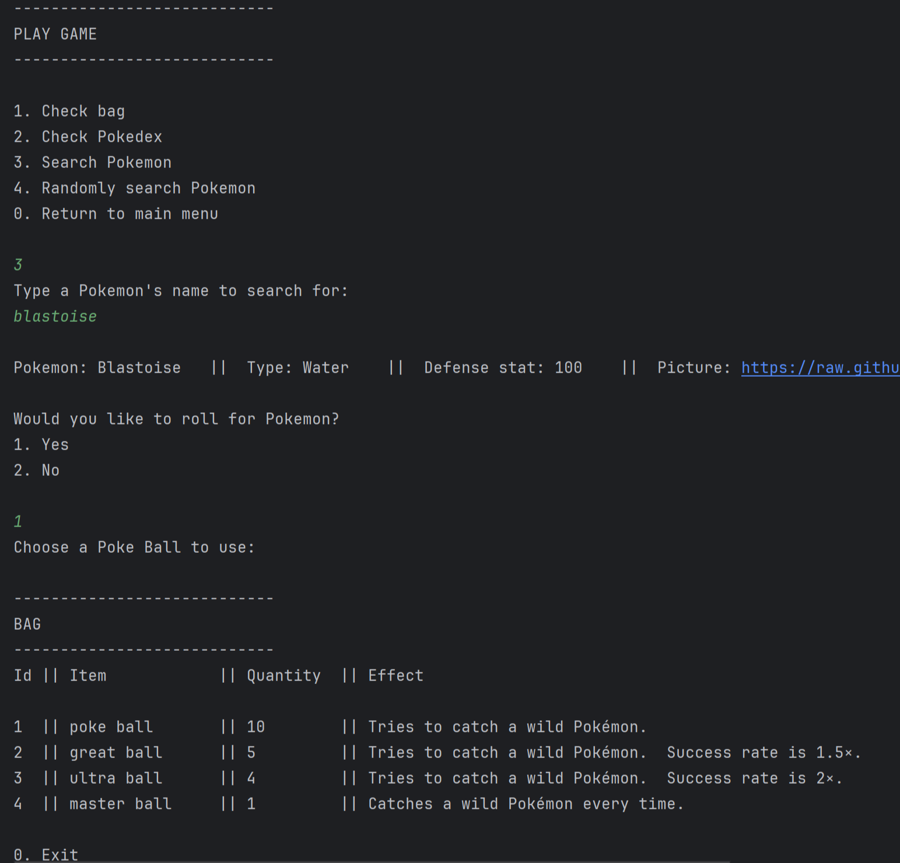

# Roll for Pokemon

## What
Roll for Pokémon is a Java-based CLI game that gives you a glimpse into the Pokémon world! You can search for Pokémon, try your luck at catching and collecting them, and even export your Pokédex data (your captured Pokémon) as an SQL or Excel file. You need absolutely zero knowledge of Pokémon — just read the rules and you’ll be fine.

## Why
To put together a project that exemplifies Java fundamentals like polymorphism, inheritance, and encapsulation. This project is also meant to showcase other practices related to API interactions with RestTemplate, 
model classes, DAO, custom exceptions, and unit testing.        

## Sources
Requested data from <a href="https://pokeapi.co/?ref=public-apis">PokeApi</a>
- Poke Ball's name: "name"
- Poke Ball's short effect: "effect_entries"[0]{"short_effect"}
- Pokémon id: "id"
- Pokémon name: "name"
- Pokémon type: "types"[0]{"type"}{"name"}
- Pokémon base stat (defense): "stats"[2]{"base_stat"}
- Pokémon sprite: "sprites"{"front_default"}

## Tools used
- Java
- Spring Boot
- SQLite
- SQL
- Apache POI
- JUnit

## Overview
Starting the application, you'll be prompted to the main menu to view the rules, play the game, export your Pokedex (captured Pokemon) as a saved SQL or Excel file, or exit the application. Don't forget to read the introduction 
above "main menu" and the "rules". Inside the "play game" prompt, you'll have the option to view your bag (inventory of balls), and your Pokedex (capture Pokemon), can manually search for Pokemon by user input, randomly search 
for Pokemon without user input, or return to the main menu. Once you search for a Pokémon, information is returned to the user and you are given the option to try and capture it. You will have to choose between 4 different 
Poke Balls that affect your chances of capture when its effect is applied to your roll (randomly generated number). If you are successful, the Pokemon is added to your Pokedex which can now be exported as a file. You only have 
20 Poke Balls to work with so test your luck and try to catch them all!

## Working app screenshots
- ### Main Menu Prompt

- ### Play Game Prompt

- ### Exported SQL File

